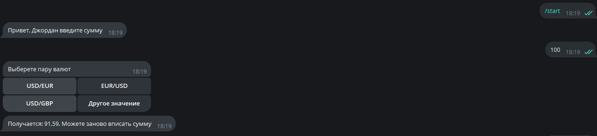
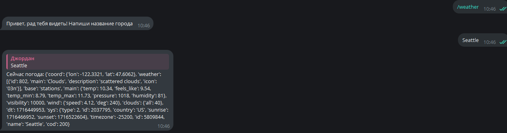

# Telegram Bot
# Описание проекта:

    Мой проект состоит из кода, написанного на языке Python в PyCharm, а также из 2 фотографий, которые присылаются отправителю в случае обращения пользователя к боту.

Я создал телеграм бота, используя бота **@BotFather**. С помощью него я создал собственного бота, используя уникальный ключ, который выдал мне "БотОтец".
```
bot = telebot.TeleBot('6431576369:AAGEZw6_k-FM6MwxlohYVv6v2CoXdfMPTQg')
```
Я решил назвать своего бота: **@CoolRooleBot**. А выглядит он так:


В моей проекте я создал лишь 2 команды, которые мой бот может обрабатывать:

1.Команда /start

2.Команда /weather

1-ая позволяет пользователю конвертировать различные валюты. 

2-ая даёт возможность узнать погоду в любом городе мира.



    Мой код на данный момент исправен и вместо строки кода выдаёт нужное значение теплоты, а также картинку, характеризующую свойство погоды -- (облачно) -- (ясно)

    По непонятным причинам система отказывается связываться с сервером OpenWeather, к которому прикреплен мой бот, и выдавать нужное значение погоды, однако, в компьютерном классе код сработал. Возможно проблемма в том, какие-то из моих скаченных библиотек сломались, а в классе все успешно обработалось.

Нужные библиотеки для скачивания:

**pip install requests**

**pip install pyTelegramBotAPI**

**pip install CurrencyConverter**

В целом код небольшой, но требует дополнительных усилий в виде подключение уникального API ключа, который выдаёт исклютельно OpenWeather, только при регистрации на их сайте, а также установке библиотек, настройки **BotFather** и так далее.
